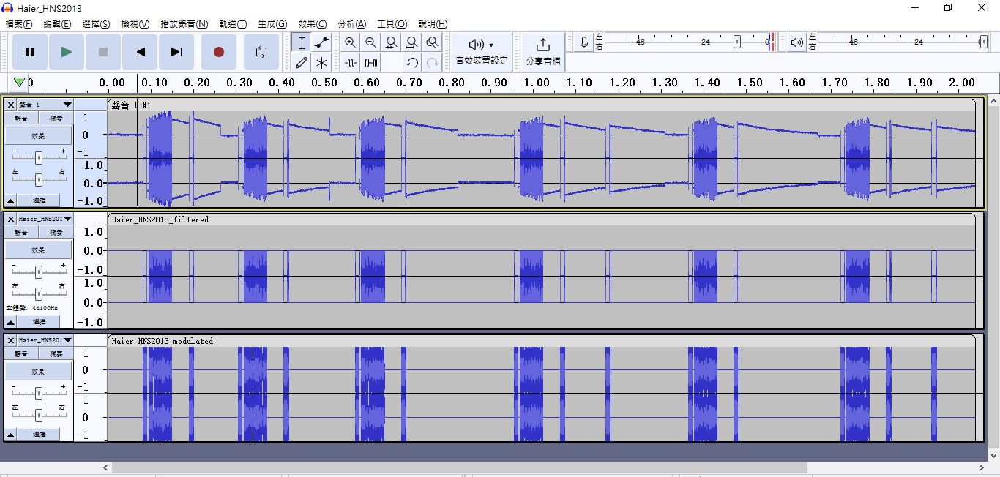
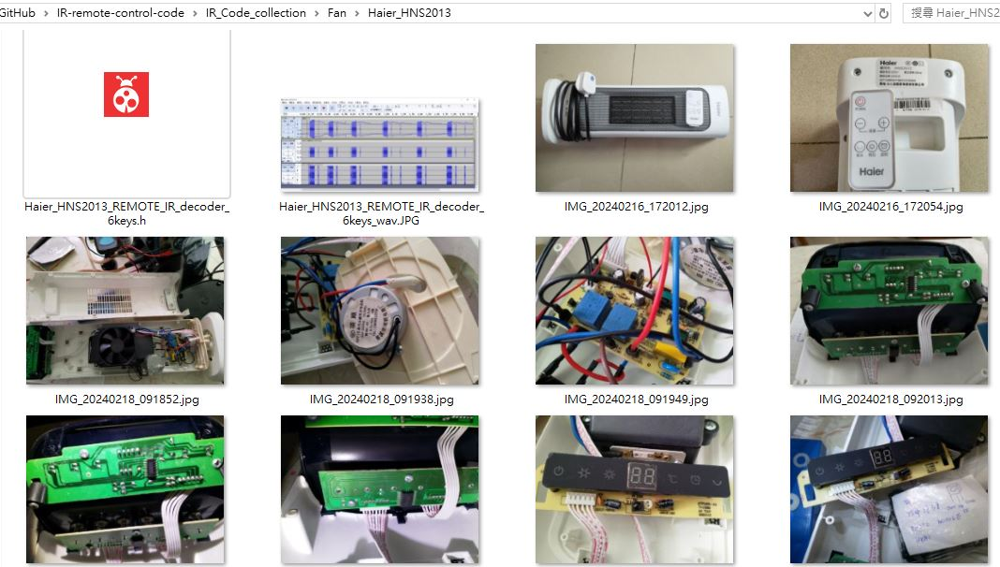

NEC2 IR signal  

### VOL+  
  

  


### complete IR codes of full remote  
Haier_HNS2013_REMOTE_IR_decoder_6keys
C header file,
[Haier_HNS2013_REMOTE_IR_decoder_6keys.h](Haier_HNS2013_REMOTE_IR_decoder_6keys.h)  
  

IR code listing,   
```
// xiaolaba, 2023/OCT/27
// START E:\2019-11-11_H_trip\DIY\TV\IR_remote_decoder\IR_decoder\IR_decoder.ino build from Oct 27 2023
// Using library version 4.1.0
// c-header file
// vcc=A5, IR_REC=A4, GND=A3

#define key_0001 0x00FF807F // 開/待機 Protocol=NEC Address=0x0 Command=0x1 Raw-Data=0xFE01FF00 32 bits LSB first
#define key_0002 0x00FF00FF // 溫度 -, Protocol=NEC Address=0x0 Command=0x0 Raw-Data=0xFF00FF00 32 bits LSB first
#define key_0003 0x00FF20DF // 溫度 +, Protocol=NEC Address=0x0 Command=0x4 Raw-Data=0xFB04FF00 32 bits LSB first
#define key_0004 0x00FF10EF // 搖頭, Protocol=NEC Address=0x0 Command=0x8 Raw-Data=0xF708FF00 32 bits LSB first
#define key_0005 0x00FFB04F // 檔位, Protocol=NEC Address=0x0 Command=0xD Raw-Data=0xF20DFF00 32 bits LSB first
#define key_0006 0x00FF906F // 定時, Protocol=NEC Address=0x0 Command=0x9 Raw-Data=0xF609FF00 32 bits LSB first

```

### decoder used
firmware & burn tool
[burn328.bat](burn328.bat)  
[IR_decoder.ino.standard.hex](IR_decoder.ino.standard.hex)  
[IR_decoder.ino.with_bootloader.standard.hex](IR_decoder.ino.with_bootloader.standard.hex)  
hardware, 
UNO/mega328p 16MHZ, LCD shield, simple IR receiver  

