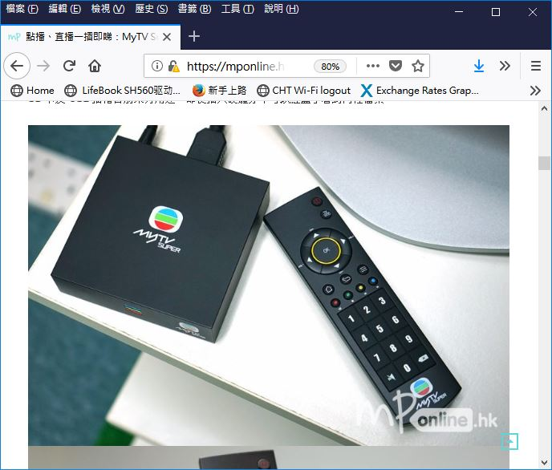

OEM product, no sample on hand  
product photo captured from internet  

IR remote control code and table  




```
IR remote decoder RC5 | RC5X | RC5-6bit | NEC
xiaolaba 2018-JUN-23
OTT, android OEM TV box
MyTV Super

SEQ,PROTOCOL,RAW,T,ADDRESS,COMMAND,BITS
1,NEC,0xFB0038C7,32_bits,
2,NEC,0xFB0020DF,32_bits,0xffffffff_repeat_code,
3,NEC,0xFB0058A7,32_bits,
4,NEC,0xFB00E21D,32_bits,0xffffffff_repeat_code,
5,NEC,0xFB00609F,32_bits,
6,NEC,0xFB00E01F,32_bits,
7,NEC,0xFB0012ED,32_bits,
8,NEC,0xFB0050AF,32_bits,
9,NEC,0xFB00926D,32_bits,
10,NEC,0xFB0018E7,32_bits,
11,NEC,0xFB00807F,32_bits,
12,NEC,0xFB00FA05,32_bits,
13,NEC,0xFB009867,32_bits,
14,NEC,0xFB001AE5,32_bits,
15,NEC,0xFB002AD5,32_bits,
16,NEC,0xFB006897,32_bits,
17,NEC,0xFB00A857,32_bits,
18,NEC,0xFB000AF5,32_bits,
19,NEC,0xFB0048B7,32_bits,
20,NEC,0xFB008877,32_bits,
21,NEC,0xFB0032CD,32_bits,
22,NEC,0xFB00708F,32_bits,
23,NEC,0xFB00B04F,32_bits,
24,NEC,0xFB003AC5,32_bits,
25,NEC,0xFB0030CF,32_bits,
26,NEC,0xFB0008F7,32_bits,


1,NEC2,0xFB0038C7,0xDF,0x0,28,227,32_bits,  ON/OFF
2,NEC2,0xFB0020DF,0xDF,0x0,4,251,32_bits,   TV/VOD
3,NEC2,0xFB0058A7,0xDF,0x0,26,229,32_bits,  CH+   
4,NEC2,0xFB00E21D,0xDF,0x0,71,184,32_bits,  VOL-  
5,NEC2,0xFB00609F,0xDF,0x0,6,249,32_bits,   OK    
6,NEC2,0xFB00E01F,0xDF,0x0,7,248,32_bits,   VOL+  
7,NEC2,0xFB0012ED,0xDF,0x0,72,183,32_bits,  CH-   
8,NEC2,0xFB0050AF,0xDF,0x0,10,245,32_bits,  HOME  
9,NEC2,0xFB00926D,0xDF,0x0,73,182,32_bits,  EXIT  
10,NEC2,0xFB0018E7,0xDF,0x0,24,231,32_bits, MENU  
11,NEC2,0xFB00807F,0xDF,0x0,1,254,32_bits,  >||   
12,NEC2,0xFB00FA05,0xDF,0x0,95,160,32_bits, PAUSE 
13,NEC2,0xFB009867,0xDF,0x0,25,230,32_bits, <<    
14,NEC2,0xFB001AE5,0xDF,0x0,88,167,32_bits, >>    
15,NEC2,0xFB002AD5,0xDF,0x0,84,171,32_bits, 1     
16,NEC2,0xFB006897,0xDF,0x0,22,233,32_bits, 2     
17,NEC2,0xFB00A857,0xDF,0x0,21,234,32_bits, 3     
18,NEC2,0xFB000AF5,0xDF,0x0,80,175,32_bits, 4     
19,NEC2,0xFB0048B7,0xDF,0x0,18,237,32_bits, 5     
20,NEC2,0xFB008877,0xDF,0x0,17,238,32_bits, 6     
21,NEC2,0xFB0032CD,0xDF,0x0,76,179,32_bits, 7     
22,NEC2,0xFB00708F,0xDF,0x0,14,241,32_bits, 8     
23,NEC2,0xFB00B04F,0xDF,0x0,13,242,32_bits, 9     
24,NEC2,0xFB003AC5,0xDF,0x0,92,163,32_bits, MUTE  
25,NEC2,0xFB0030CF,0xDF,0x0,12,243,32_bits, 0     
26,NEC2,0xFB0008F7,0xDF,0x0,16,239,32_bits, <X    
```
