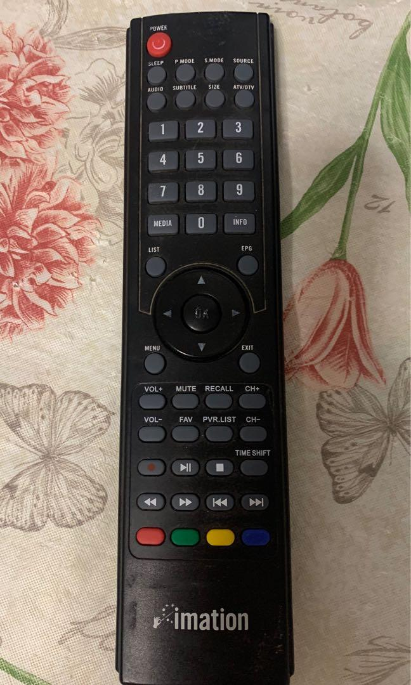

  

```
// START E:\DIY\2022-02-03_Imation_iDTV-H240 23.6吋電視\IR_decoder\IR_decoder.ino from Feb  3 2022
// Using library version 3.5.0
// c-header file

// 24吋 全高清 1920 X 1080
// TV　& MON
// 兩組 HDMI 一組VGA RCA等輸入 
// 搖控

#define key_0001 0x20D352AD // Protocol=NEC Address=0xCB04 Command=0x4A Raw-Data=0xB54ACB04 32 bits LSB first
#define key_0002 0x20D312ED // Protocol=NEC Address=0xCB04 Command=0x48 Raw-Data=0xB748CB04 32 bits LSB first
#define key_0003 0x20D3F00F // Protocol=NEC Address=0xCB04 Command=0xF Raw-Data=0xF00FCB04 32 bits LSB first
#define key_0004 0x20D3B24D // Protocol=NEC Address=0xCB04 Command=0x4D Raw-Data=0xB24DCB04 32 bits LSB first
#define key_0005 0x20D3728D // Protocol=NEC Address=0xCB04 Command=0x4E Raw-Data=0xB14ECB04 32 bits LSB first
#define key_0006 0x20D322DD // Protocol=NEC Address=0xCB04 Command=0x44 Raw-Data=0xBB44CB04 32 bits LSB first
#define key_0007 0x20D3C837 // Protocol=NEC Address=0xCB04 Command=0x13 Raw-Data=0xEC13CB04 32 bits LSB first
#define key_0008 0x20D38A75 // Protocol=NEC Address=0xCB04 Command=0x51 Raw-Data=0xAE51CB04 32 bits LSB first
#define key_0009 0x20D34AB5 // Protocol=NEC Address=0xCB04 Command=0x52 Raw-Data=0xAD52CB04 32 bits LSB first
#define key_0010 0x20D3827D // Protocol=NEC Address=0xCB04 Command=0x41 Raw-Data=0xBE41CB04 32 bits LSB first
#define key_0011 0x20D3C03F // Protocol=NEC Address=0xCB04 Command=0x3 Raw-Data=0xFC03CB04 32 bits LSB first
#define key_0012 0x20D342BD // Protocol=NEC Address=0xCB04 Command=0x42 Raw-Data=0xBD42CB04 32 bits LSB first
#define key_0013 0x20D3A25D // Protocol=NEC Address=0xCB04 Command=0x45 Raw-Data=0xBA45CB04 32 bits LSB first
#define key_0014 0x20D3E01F // Protocol=NEC Address=0xCB04 Command=0x7 Raw-Data=0xF807CB04 32 bits LSB first
#define key_0015 0x20D3629D // Protocol=NEC Address=0xCB04 Command=0x46 Raw-Data=0xB946CB04 32 bits LSB first
#define key_0016 0x20D3AA55 // Protocol=NEC Address=0xCB04 Command=0x55 Raw-Data=0xAA55CB04 32 bits LSB first
#define key_0017 0x20D3E817 // Protocol=NEC Address=0xCB04 Command=0x17 Raw-Data=0xE817CB04 32 bits LSB first
#define key_0018 0x20D36A95 // Protocol=NEC Address=0xCB04 Command=0x56 Raw-Data=0xA956CB04 32 bits LSB first
#define key_0019 0x20D39A65 // Protocol=NEC Address=0xCB04 Command=0x59 Raw-Data=0xA659CB04 32 bits LSB first
#define key_0020 0x20D3D827 // Protocol=NEC Address=0xCB04 Command=0x1B Raw-Data=0xE41BCB04 32 bits LSB first
#define key_0021 0x20D35AA5 // Protocol=NEC Address=0xCB04 Command=0x5A Raw-Data=0xA55ACB04 32 bits LSB first
#define key_0022 0x20D3E21D // Protocol=NEC Address=0xCB04 Command=0x47 Raw-Data=0xB847CB04 32 bits LSB first
#define key_0023 0x20D3A05F // Protocol=NEC Address=0xCB04 Command=0x5 Raw-Data=0xFA05CB04 32 bits LSB first
#define key_0024 0x20D3609F // Protocol=NEC Address=0xCB04 Command=0x6 Raw-Data=0xF906CB04 32 bits LSB first
#define key_0025 0x20D3C23D // Protocol=NEC Address=0xCB04 Command=0x43 Raw-Data=0xBC43CB04 32 bits LSB first
#define key_0026 0x20D340BF // Protocol=NEC Address=0xCB04 Command=0x2 Raw-Data=0xFD02CB04 32 bits LSB first
#define key_0027 0x20D3807F // Protocol=NEC Address=0xCB04 Command=0x1 Raw-Data=0xFE01CB04 32 bits LSB first
#define key_0028 0x20D350AF // Protocol=NEC Address=0xCB04 Command=0xA Raw-Data=0xF50ACB04 32 bits LSB first
#define key_0029 0x20D3D22D // Protocol=NEC Address=0xCB04 Command=0x4B Raw-Data=0xB44BCB04 32 bits LSB first
#define key_0030 0x20D3906F // Protocol=NEC Address=0xCB04 Command=0x9 Raw-Data=0xF609CB04 32 bits LSB first
#define key_0031 0x20D3CA35 // Protocol=NEC Address=0xCB04 Command=0x53 Raw-Data=0xAC53CB04 32 bits LSB first
#define key_0032 0x20D348B7 // Protocol=NEC Address=0xCB04 Command=0x12 Raw-Data=0xED12CB04 32 bits LSB first
#define key_0033 0x20D30AF5 // Protocol=NEC Address=0xCB04 Command=0x50 Raw-Data=0xAF50CB04 32 bits LSB first
#define key_0034 0x20D38877 // Protocol=NEC Address=0xCB04 Command=0x11 Raw-Data=0xEE11CB04 32 bits LSB first
#define key_0035 0x20D3F20D // Protocol=NEC Address=0xCB04 Command=0x4F Raw-Data=0xB04FCB04 32 bits LSB first
#define key_0036 0x20D3708F // Protocol=NEC Address=0xCB04 Command=0xE Raw-Data=0xF10ECB04 32 bits LSB first
#define key_0037 0x20D332CD // Protocol=NEC Address=0xCB04 Command=0x4C Raw-Data=0xB34CCB04 32 bits LSB first
#define key_0038 0x20D3B04F // Protocol=NEC Address=0xCB04 Command=0xD Raw-Data=0xF20DCB04 32 bits LSB first
#define key_0039 0x20D3EA15 // Protocol=NEC Address=0xCB04 Command=0x57 Raw-Data=0xA857CB04 32 bits LSB first
#define key_0040 0x20D36897 // Protocol=NEC Address=0xCB04 Command=0x16 Raw-Data=0xE916CB04 32 bits LSB first
#define key_0041 0x20D32AD5 // Protocol=NEC Address=0xCB04 Command=0x54 Raw-Data=0xAB54CB04 32 bits LSB first
#define key_0042 0x20D3A857 // Protocol=NEC Address=0xCB04 Command=0x15 Raw-Data=0xEA15CB04 32 bits LSB first
#define key_0043 0x20D3DA25 // Protocol=NEC Address=0xCB04 Command=0x5B Raw-Data=0xA45BCB04 32 bits LSB first
#define key_0044 0x20D358A7 // Protocol=NEC Address=0xCB04 Command=0x1A Raw-Data=0xE51ACB04 32 bits LSB first
#define key_0045 0x20D31AE5 // Protocol=NEC Address=0xCB04 Command=0x58 Raw-Data=0xA758CB04 32 bits LSB first
#define key_0046 0x20D39867 // Protocol=NEC Address=0xCB04 Command=0x19 Raw-Data=0xE619CB04 32 bits LSB first
#define key_0047 0x20D3FA05 // Protocol=NEC Address=0xCB04 Command=0x5F Raw-Data=0xA05FCB04 32 bits LSB first
#define key_0048 0x20D37887 // Protocol=NEC Address=0xCB04 Command=0x1E Raw-Data=0xE11ECB04 32 bits LSB first
#define key_0049 0x20D33AC5 // Protocol=NEC Address=0xCB04 Command=0x5C Raw-Data=0xA35CCB04 32 bits LSB first
#define key_0050 0x20D3B847 // Protocol=NEC Address=0xCB04 Command=0x1D Raw-Data=0xE21DCB04 32 bits LSB first

```
