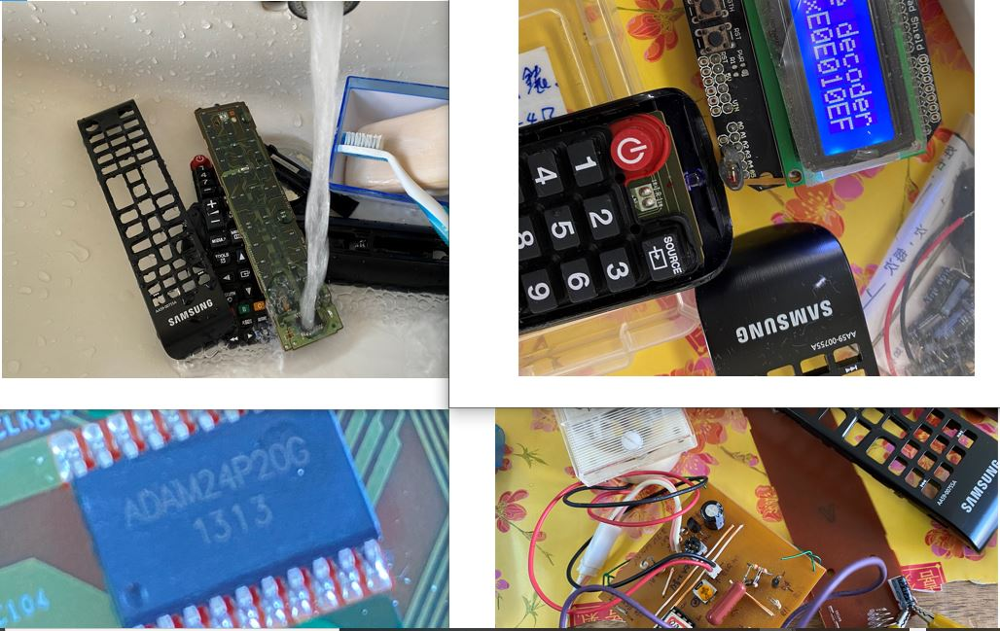
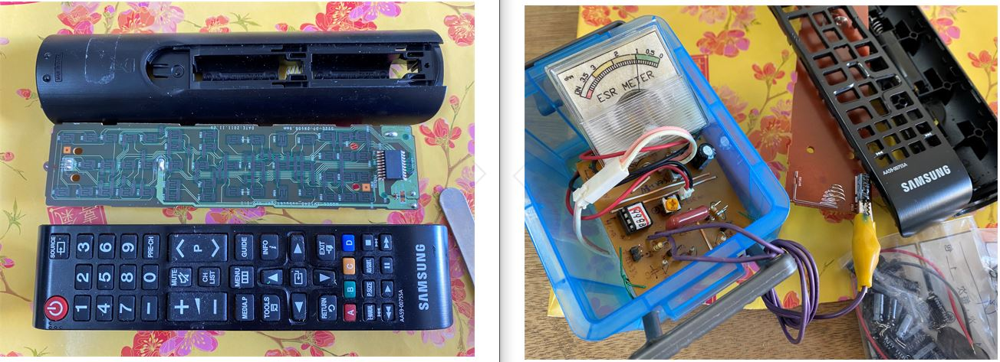

[SAMSUNG_AA59-00755A.h](SAMSUNG_AA59-00755A.h)






```
#define key_0001 0xE0E040BF // Protocol=SAMSUNG Address=0x707 Command=0x2 Raw-Data=0xFD020707 32 bits LSB first
#define key_0002 0xE0E0807F // Protocol=SAMSUNG Address=0x707 Command=0x1 Raw-Data=0xFE010707 32 bits LSB first
#define key_0003 0xE0E020DF // Protocol=SAMSUNG Address=0x707 Command=0x4 Raw-Data=0xFB040707 32 bits LSB first
#define key_0004 0xE0E0A05F // Protocol=SAMSUNG Address=0x707 Command=0x5 Raw-Data=0xFA050707 32 bits LSB first
#define key_0005 0xE0E0609F // Protocol=SAMSUNG Address=0x707 Command=0x6 Raw-Data=0xF9060707 32 bits LSB first
#define key_0006 0xE0E010EF // Protocol=SAMSUNG Address=0x707 Command=0x8 Raw-Data=0xF7080707 32 bits LSB first
#define key_0007 0xE0E0906F // Protocol=SAMSUNG Address=0x707 Command=0x9 Raw-Data=0xF6090707 32 bits LSB first
#define key_0008 0xE0E050AF // Protocol=SAMSUNG Address=0x707 Command=0xA Raw-Data=0xF50A0707 32 bits LSB first
#define key_0009 0xE0E030CF // Protocol=SAMSUNG Address=0x707 Command=0xC Raw-Data=0xF30C0707 32 bits LSB first
#define key_0010 0xE0E0B04F // Protocol=SAMSUNG Address=0x707 Command=0xD Raw-Data=0xF20D0707 32 bits LSB first
#define key_0011 0xE0E0708F // Protocol=SAMSUNG Address=0x707 Command=0xE Raw-Data=0xF10E0707 32 bits LSB first
#define key_0012 0xE0E0C43B // Protocol=SAMSUNG Address=0x707 Command=0x23 Raw-Data=0xDC230707 32 bits LSB first
#define key_0013 0xE0E08877 // Protocol=SAMSUNG Address=0x707 Command=0x11 Raw-Data=0xEE110707 32 bits LSB first
#define key_0014 0xE0E0C837 // Protocol=SAMSUNG Address=0x707 Command=0x13 Raw-Data=0xEC130707 32 bits LSB first
#define key_0015 0xE0E0E01F // Protocol=SAMSUNG Address=0x707 Command=0x7 Raw-Data=0xF8070707 32 bits LSB first
#define key_0016 0xE0E0F00F // Protocol=SAMSUNG Address=0x707 Command=0xF Raw-Data=0xF00F0707 32 bits LSB first
#define key_0017 0xE0E048B7 // Protocol=SAMSUNG Address=0x707 Command=0x12 Raw-Data=0xED120707 32 bits LSB first
#define key_0018 0xE0E0D02F // Protocol=SAMSUNG Address=0x707 Command=0xB Raw-Data=0xF40B0707 32 bits LSB first
#define key_0019 0xE0E0D629 // Protocol=SAMSUNG Address=0x707 Command=0x6B Raw-Data=0x946B0707 32 bits LSB first
#define key_0020 0xE0E008F7 // Protocol=SAMSUNG Address=0x707 Command=0x10 Raw-Data=0xEF100707 32 bits LSB first
#define key_0021 0xE0E031CE // Protocol=SAMSUNG Address=0x707 Command=0x8C Raw-Data=0x738C0707 32 bits LSB first
#define key_0022 0xE0E058A7 // Protocol=SAMSUNG Address=0x707 Command=0x1A Raw-Data=0xE51A0707 32 bits LSB first
#define key_0023 0xE0E0F20D // Protocol=SAMSUNG Address=0x707 Command=0x4F Raw-Data=0xB04F0707 32 bits LSB first
#define key_0024 0xE0E0D22D // Protocol=SAMSUNG Address=0x707 Command=0x4B Raw-Data=0xB44B0707 32 bits LSB first
#define key_0025 0xE0E006F9 // Protocol=SAMSUNG Address=0x707 Command=0x60 Raw-Data=0x9F600707 32 bits LSB first
#define key_0026 0xE0E0F807 // Protocol=SAMSUNG Address=0x707 Command=0x1F Raw-Data=0xE01F0707 32 bits LSB first
#define key_0027 0xE0E0A659 // Protocol=SAMSUNG Address=0x707 Command=0x65 Raw-Data=0x9A650707 32 bits LSB first
#define key_0028 0xE0E016E9 // Protocol=SAMSUNG Address=0x707 Command=0x68 Raw-Data=0x97680707 32 bits LSB first
#define key_0029 0xE0E046B9 // Protocol=SAMSUNG Address=0x707 Command=0x62 Raw-Data=0x9D620707 32 bits LSB first
#define key_0030 0xE0E01AE5 // Protocol=SAMSUNG Address=0x707 Command=0x58 Raw-Data=0xA7580707 32 bits LSB first
#define key_0031 0xE0E08679 // Protocol=SAMSUNG Address=0x707 Command=0x61 Raw-Data=0x9E610707 32 bits LSB first
#define key_0032 0xE0E0B44B // Protocol=SAMSUNG Address=0x707 Command=0x2D Raw-Data=0xD22D0707 32 bits LSB first
#define key_0033 0xE0E036C9 // Protocol=SAMSUNG Address=0x707 Command=0x6C Raw-Data=0x936C0707 32 bits LSB first
#define key_0034 0xE0E028D7 // Protocol=SAMSUNG Address=0x707 Command=0x14 Raw-Data=0xEB140707 32 bits LSB first
#define key_0035 0xE0E0A857 // Protocol=SAMSUNG Address=0x707 Command=0x15 Raw-Data=0xEA150707 32 bits LSB first
#define key_0036 0xE0E06897 // Protocol=SAMSUNG Address=0x707 Command=0x16 Raw-Data=0xE9160707 32 bits LSB first
#define key_0037 0xE0E0FC03 // Protocol=SAMSUNG Address=0x707 Command=0x3F Raw-Data=0xC03F0707 32 bits LSB first
#define key_0038 0xE0E07C83 // Protocol=SAMSUNG Address=0x707 Command=0x3E Raw-Data=0xC13E0707 32 bits LSB first
#define key_0039 0xE0E0A45B // Protocol=SAMSUNG Address=0x707 Command=0x25 Raw-Data=0xDA250707 32 bits LSB first
#define key_0040 0xE0E0629D // Protocol=SAMSUNG Address=0x707 Command=0x46 Raw-Data=0xB9460707 32 bits LSB first
#define key_0041 0xE0E0A25D // Protocol=SAMSUNG Address=0x707 Command=0x45 Raw-Data=0xBA450707 32 bits LSB first
#define key_0042 0xE0E0E21D // Protocol=SAMSUNG Address=0x707 Command=0x47 Raw-Data=0xB8470707 32 bits LSB first
#define key_0043 0xE0E052AD // Protocol=SAMSUNG Address=0x707 Command=0x4A Raw-Data=0xB54A0707 32 bits LSB first
#define key_0044 0xE0E012ED // Protocol=SAMSUNG Address=0x707 Command=0x48 Raw-Data=0xB7480707 32 bits LSB first

```
