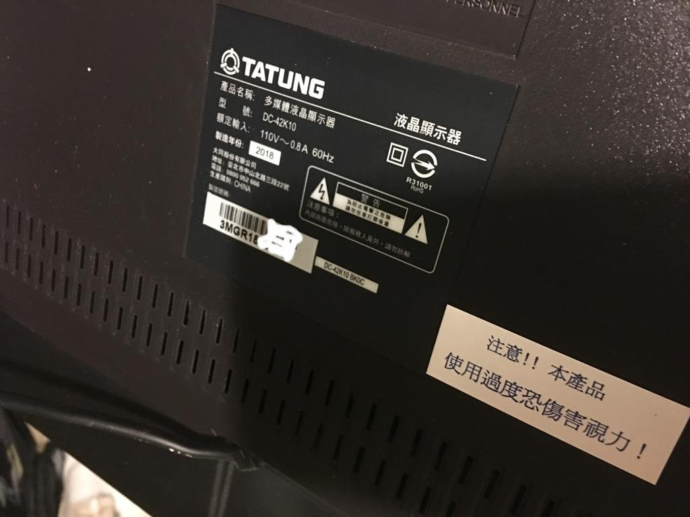
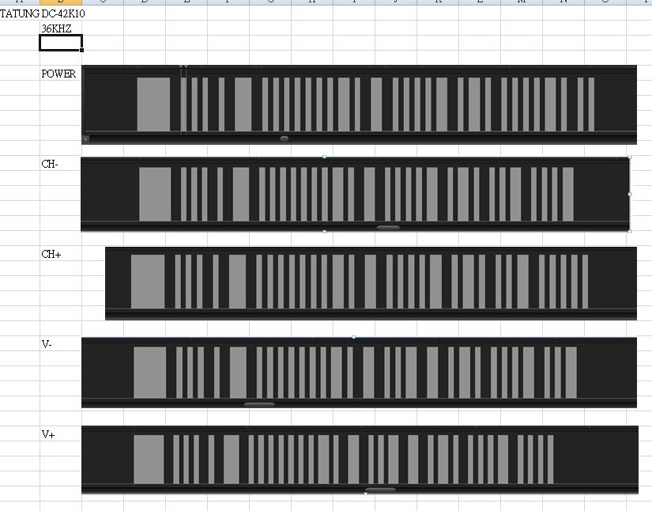
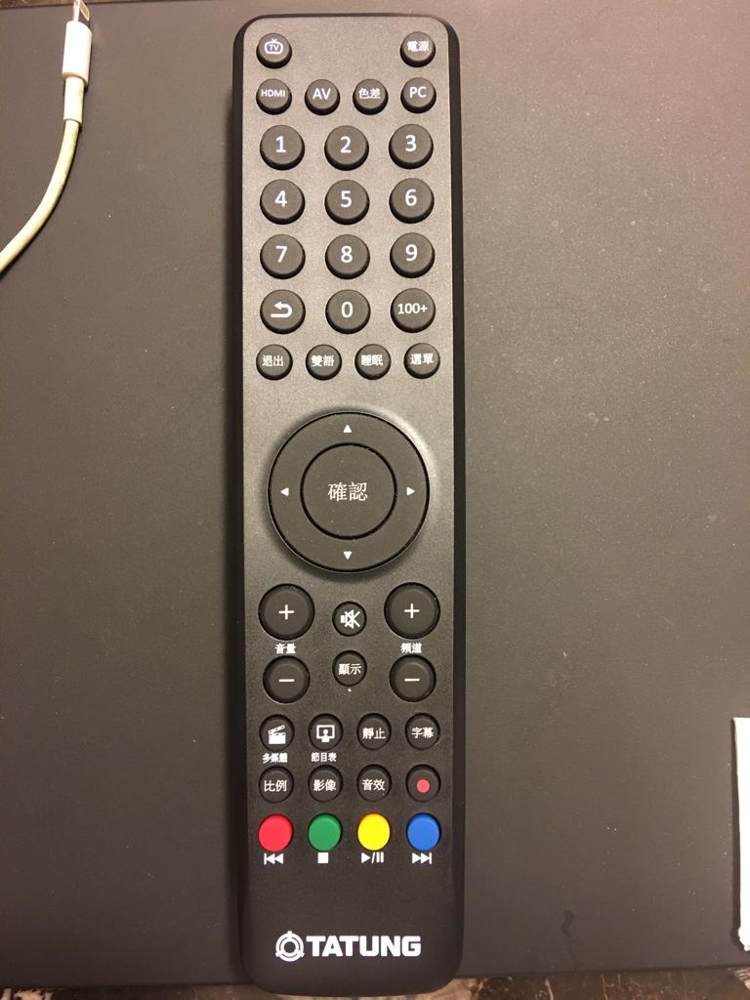

TATUNG 42" LCD TV  
model:  
  

unknow controller broad  

Philips RC-6 signals, 36 kHz duty cycle between 25% and 50%.

Data is modulated using Manchester coding, each bit (or symbol) will have both a mark and space in the output signal.

logic "1" = mark_space  
logic "0" = space_mark  
(Please note that this is the opposite of the RC-5 protocol!)

The main timing unit is 1t, which is 16 times the carrier period (1/36k * 16 = 444µs)

REF: https://www.sbprojects.net/knowledge/ir/rc6.php  

spec  
  

IR signal    
  

IR remote, model : N/A

