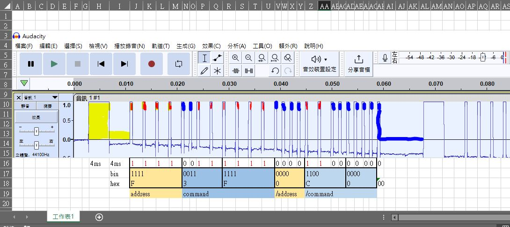
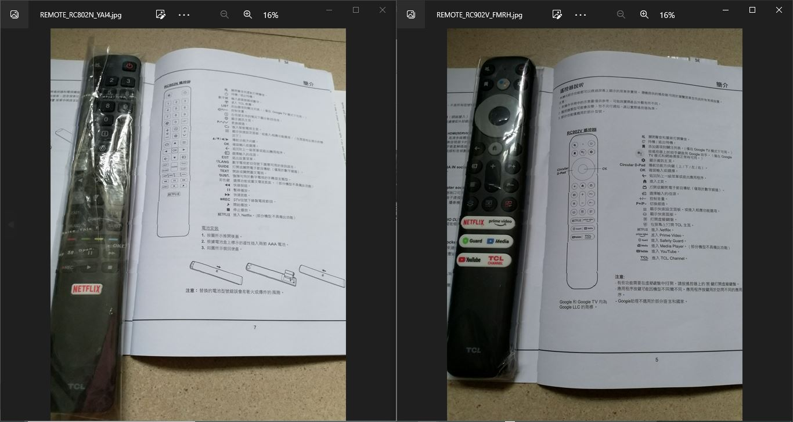

IR signal protocol, RCA ?  
[IR signal protocol, RCA ?](https://github.com/xiaolaba/IR-remote-control-code/blob/master/TV/TCL32D3000B/README.md)https://github.com/xiaolaba/IR-remote-control-code/blob/master/TV/TCL32D3000B/README.md

RCA protocol  
  

  

### Remote1 RC902V c header file
[REMOTE_RC902V_FMRH.h](REMOTE_RC902V_FMRH.h)  
```
// START E:\2019-11-11_HK_trip\DIY\TV\IR_remote_decoder\IR_decoder\IR_decoder.ino build from Oct 27 2023
// Author, xiaolaba
// Using library version 4.1.0
// c-header file
// vcc=A5, IR_REC=A4, GND=A3

// TCL REMOTE_FA902V_FMRH

#define key_0001 0xF3F0C000 // Protocol=PulseDistance Raw-Data=0x30FCF 24 bits LSB first
#define key_0002 0xF2A0D500 // Protocol=PulseDistance Raw-Data=0xAB054F 24 bits LSB first
#define key_0003 0xF6109E00 // Protocol=PulseDistance Raw-Data=0x79086F 24 bits LSB first
#define key_0004 0xF5C0A300 // Protocol=PulseDistance Raw-Data=0xC503AF 24 bits LSB first
#define key_0005 0xFCF03000 // Protocol=PulseDistance Raw-Data=0xC0F3F 24 bits LSB first
#define key_0006 0xF590A600 // Protocol=PulseDistance Raw-Data=0x6509AF 24 bits LSB first
#define key_0007 0xF560A900 // Protocol=PulseDistance Raw-Data=0x9506AF 24 bits LSB first
#define key_0008 0xFF400B00 // Protocol=PulseDistance Raw-Data=0xD002FF 24 bits LSB first
#define key_0009 0xF570A800 // Protocol=PulseDistance Raw-Data=0x150EAF 24 bits LSB first
#define key_0010 0xF580A700 // Protocol=PulseDistance Raw-Data=0xE501AF 24 bits LSB first
#define key_0011 0xF270D800 // Protocol=PulseDistance Raw-Data=0x1B0E4F 24 bits LSB first
#define key_0012 0xF080F700 // Protocol=PulseDistance Raw-Data=0xEF010F 24 bits LSB first
#define key_0013 0xF1A0E500 // Protocol=PulseDistance Raw-Data=0xA7058F 24 bits LSB first
#define key_0014 0xFA305C00 // Protocol=PulseDistance Raw-Data=0x3A0C5F 24 bits LSB first
#define key_0015 0xF2F0D000 // Protocol=PulseDistance Raw-Data=0xB0F4F 24 bits LSB first
#define key_0016 0xF2D0D200 // Protocol=PulseDistance Raw-Data=0x4B0B4F 24 bits LSB first
#define key_0017 0xFEC01300 // Protocol=PulseDistance Raw-Data=0xC8037F 24 bits LSB first
#define key_0018 0xF2E0D100 // Protocol=PulseDistance Raw-Data=0x8B074F 24 bits LSB first
#define key_0019 0xF2C0D300 // Protocol=PulseDistance Raw-Data=0xCB034F 24 bits LSB first
#define key_0020 0xF7C08300 // Protocol=PulseDistance Raw-Data=0xC103EF 24 bits LSB first
#define key_0021 0xFCD03200 // Protocol=PulseDistance Raw-Data=0x4C0B3F 24 bits LSB first
#define key_0022 0xF7F08000 // Protocol=PulseDistance Raw-Data=0x10FEF 24 bits LSB first
#define key_0023 0xFEF01000 // Protocol=PulseDistance Raw-Data=0x80F7F 24 bits LSB first
#define key_0024 0xFC103E00 // Protocol=PulseDistance Raw-Data=0x7C083F 24 bits LSB first
#define key_0025 0xF7A08500 // Protocol=PulseDistance Raw-Data=0xA105EF 24 bits LSB first
#define key_0026 0xF020FD00 // Protocol=PulseDistance Raw-Data=0xBF040F 24 bits LSB first
#define key_0027 0xFE201D00 // Protocol=PulseDistance Raw-Data=0xB8047F 24 bits LSB first
#define key_0028 0xFE301C00 // Protocol=PulseDistance Raw-Data=0x380C7F 24 bits LSB first


```

### REmote2 RC802N c header file
[REMOTE_RC802N_YAI4.h](REMOTE_RC802N_YAI4.h)  
```
// START E:\2019-11-11_HK_trip\DIY\TV\IR_remote_decoder\IR_decoder\IR_decoder.ino build from Oct 30 2023
// Using library version 4.1.0
// Author, xiaolaba
// c-header file
// vcc=A5, IR_REC=A4, GND=A3

// TCL REMOTE_RC802N_YAI4

#define key_0001 0xF3F0C000 // Protocol=PulseDistance Raw-Data=0x30FCF 24 bits LSB first
#define key_0002 0xF2A0D500 // Protocol=PulseDistance Raw-Data=0xAB054F 24 bits LSB first
#define key_0003 0xF310CE00 // Protocol=PulseDistance Raw-Data=0x7308CF 24 bits LSB first
#define key_0004 0xF320CD00 // Protocol=PulseDistance Raw-Data=0xB304CF 24 bits LSB first
#define key_0005 0xF330CC00 // Protocol=PulseDistance Raw-Data=0x330CCF 24 bits LSB first
#define key_0006 0xF340CB00 // Protocol=PulseDistance Raw-Data=0xD302CF 24 bits LSB first
#define key_0007 0xF350CA00 // Protocol=PulseDistance Raw-Data=0x530ACF 24 bits LSB first
#define key_0008 0xF360C900 // Protocol=PulseDistance Raw-Data=0x9306CF 24 bits LSB first
#define key_0009 0xF370C800 // Protocol=PulseDistance Raw-Data=0x130ECF 24 bits LSB first
#define key_0010 0xF380C700 // Protocol=PulseDistance Raw-Data=0xE301CF 24 bits LSB first
#define key_0011 0xF390C600 // Protocol=PulseDistance Raw-Data=0x6309CF 24 bits LSB first
#define key_0012 0xFE301C00 // Protocol=PulseDistance Raw-Data=0x380C7F 24 bits LSB first
#define key_0013 0xF300CF00 // Protocol=PulseDistance Raw-Data=0xF300CF 24 bits LSB first
#define key_0014 0xF6109E00 // Protocol=PulseDistance Raw-Data=0x79086F 24 bits LSB first
#define key_0015 0xF2F0D000 // Protocol=PulseDistance Raw-Data=0xB0F4F 24 bits LSB first
#define key_0016 0xF3C0C300 // Protocol=PulseDistance Raw-Data=0xC303CF 24 bits LSB first
#define key_0017 0xF2D0D200 // Protocol=PulseDistance Raw-Data=0x4B0B4F 24 bits LSB first
#define key_0018 0xF2E0D100 // Protocol=PulseDistance Raw-Data=0x8B074F 24 bits LSB first
#define key_0019 0xFCF03000 // Protocol=PulseDistance Raw-Data=0xC0F3F 24 bits LSB first
#define key_0020 0xF2C0D300 // Protocol=PulseDistance Raw-Data=0xCB034F 24 bits LSB first
#define key_0021 0xF080F700 // Protocol=PulseDistance Raw-Data=0xEF010F 24 bits LSB first
#define key_0022 0xF590A600 // Protocol=PulseDistance Raw-Data=0x6509AF 24 bits LSB first
#define key_0023 0xFEC01300 // Protocol=PulseDistance Raw-Data=0xC8037F 24 bits LSB first
#define key_0024 0xF560A900 // Protocol=PulseDistance Raw-Data=0x9506AF 24 bits LSB first
#define key_0025 0xFF400B00 // Protocol=PulseDistance Raw-Data=0xD002FF 24 bits LSB first
#define key_0026 0xF570A800 // Protocol=PulseDistance Raw-Data=0x150EAF 24 bits LSB first
#define key_0027 0xF270D800 // Protocol=PulseDistance Raw-Data=0x1B0E4F 24 bits LSB first
#define key_0028 0xF580A700 // Protocol=PulseDistance Raw-Data=0xE501AF 24 bits LSB first
#define key_0029 0xFA305C00 // Protocol=PulseDistance Raw-Data=0x3A0C5F 24 bits LSB first
#define key_0030 0xF060F900 // Protocol=PulseDistance Raw-Data=0x9F060F 24 bits LSB first
#define key_0031 0xF1A0E500 // Protocol=PulseDistance Raw-Data=0xA7058F 24 bits LSB first
#define key_0032 0xF1E0E100 // Protocol=PulseDistance Raw-Data=0x87078F 24 bits LSB first
#define key_0033 0xFDF02000 // Protocol=PulseDistance Raw-Data=0x40FBF 24 bits LSB first
#define key_0034 0xF1A0E500 // Protocol=PulseDistance Raw-Data=0xA7058F 24 bits LSB first
#define key_0035 0xF8007F00 // Protocol=PulseDistance Raw-Data=0xFE001F 24 bits LSB first
#define key_0036 0xF000FF00 // Protocol=PulseDistance Raw-Data=0xFF000F 24 bits LSB first
#define key_0037 0xFE801700 // Protocol=PulseDistance Raw-Data=0xE8017F 24 bits LSB first
#define key_0038 0xFE401B00 // Protocol=PulseDistance Raw-Data=0xD8027F 24 bits LSB first
#define key_0039 0xFD802700 // Protocol=PulseDistance Raw-Data=0xE401BF 24 bits LSB first
#define key_0040 0xF1D0E200 // Protocol=PulseDistance Raw-Data=0x470B8F 24 bits LSB first
#define key_0041 0xF190E600 // Protocol=PulseDistance Raw-Data=0x67098F 24 bits LSB first
#define key_0042 0xF1C0E300 // Protocol=PulseDistance Raw-Data=0xC7038F 24 bits LSB first
#define key_0043 0xF170E800 // Protocol=PulseDistance Raw-Data=0x170E8F 24 bits LSB first
#define key_0044 0xF150EA00 // Protocol=PulseDistance Raw-Data=0x570A8F 24 bits LSB first
#define key_0045 0xF1F0E000 // Protocol=PulseDistance Raw-Data=0x70F8F 24 bits LSB first
#define key_0046 0xFEF01000 // Protocol=PulseDistance Raw-Data=0x80F7F 24 bits LSB first


```


### project files
```
b.bat
mir.exe
my.html
RCA_protocol.xlsx
REMOTE_RC802N_YAI4.h
REMOTE_RC802N_YAI4.jpg
REMOTE_RC902V_FMRH.h
REMOTE_RC902V_FMRH.jpg
TCL_MUTE_ANALYSIS.JPG
TCL_MUTE_WAVE_L+.wav
TCL_MUTE_WAVE_L+_filtered.wav
TCL_MUTE_WAVE_L+_modulated.wav
TCL_MUTE_WAVE_R+.wav
TCL_MUTE_WAVE_R+_filtered.wav
TCL_MUTE_WAVE_R+_modulated.wav
TCL_REMOTE_RC902V_RC802V.JPG
YEAR2022_C835.JPG
```
