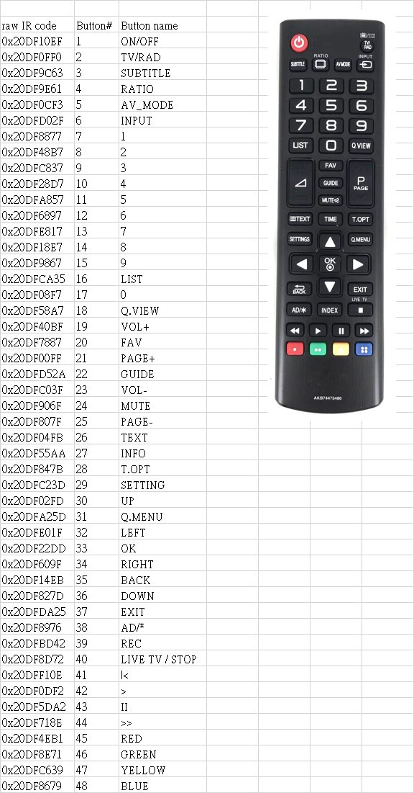
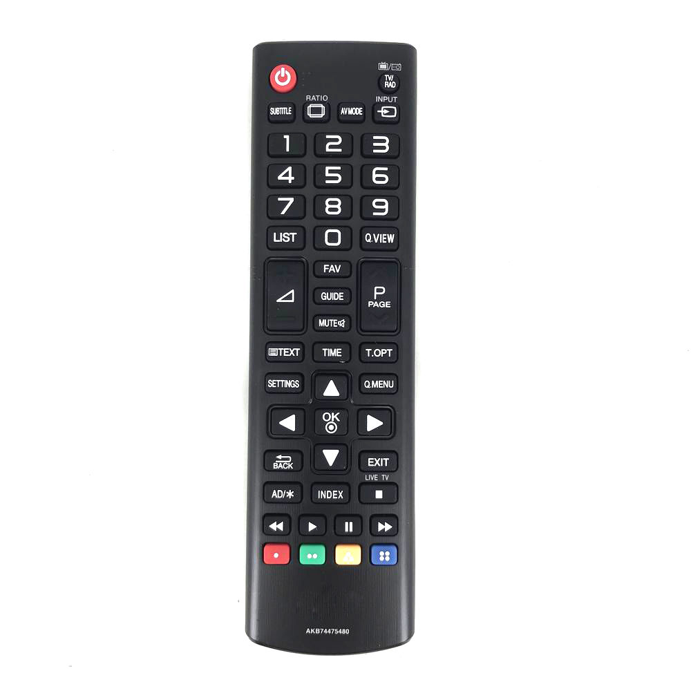
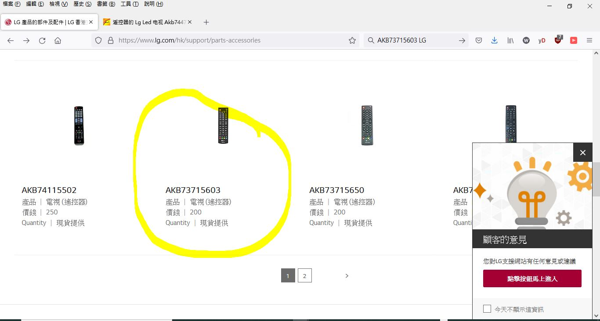
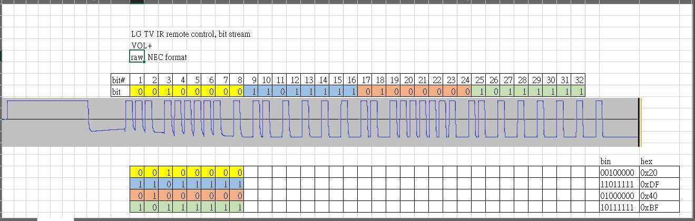
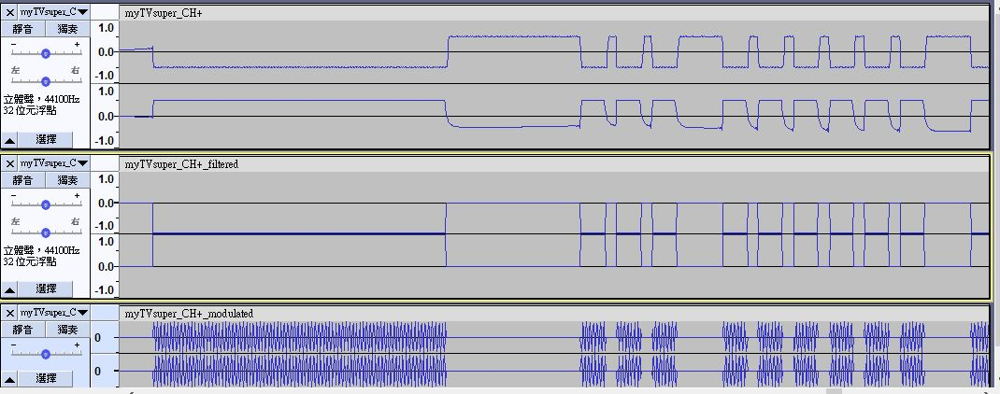

### remote control AKB74475480  
RMB60 or HKD$200  

### my remote decoded,
  

### remote
  
  


### c code header
[LG_42LB5610_remote_AKB74475480.h](LG_42LB5610_remote_AKB74475480.h)


### copy and reference,
  

```
// xiaolaba, 2022-JAN-24/
// used real remote control to log IR singal of VOL+
// resultant is matching the following, see excel sheet for visual.

// should be NEC / 38KHz IR signal stream
// TV, LG 42LB5610-CD


// copied from https://gist.github.com/francis2110/8f69843dd57ae07dce80

key press	IR code raw stream HEX
on/off	0x20DF10EF
energy	0x20DFA956
av. mode	0x20DF0CF3
input	0x20DFD02F
tv/rad	0x20DF0FF0
1	0x20DF8877
2	0x20DF48B7
3	0x20DFC837
4	0x20DF28D7
5	0x20DFA857
6	0x20DF6897
7	0x20DFE817
8	0x20DF18E7
9	0x20DF9867
0	0x20DF08F7
list	0x20DFCA35
quick view	0x20DF58A7
vol +	0x20DF40BF
vol -	0x20DFC03F
prog. +	0x20DF00FF
prog.  -	0x20DF807F
guide	0x20DFD52A
home	0x20DFC23D
fav	0x20DF7887
ratio	0x20DF9E61
mute	0x20DF906F
arrow up	0x20DF02FD
arrow down	0x20DF827D
arrow right	0x20DF609F
arrow left	0x20DFE01F
ok button	0x20DF22DD
back	0x20DF14EB
info	0x20DF55AA
exit	0x20DFDA25
red button	0x20DF4EB1
green button	0x20DF8E71
yellow button	0x20DFC639
blue button 	0x20DF8679
text	0x20DF04FB
t.opot	0x20DF847B
subtitle	0x20DF9C63
stop	0x20DF8D72
play	0x20DF0DF2
pause	0x20DF5DA2
rew	0x20DFF10E
forward	0x20DF718E
ad	0x20DF8976

```


### try to play wave file of VOL+ to control LG TV  
mir tools to build desired wave file, https://github.com/xiaolaba/IR-remote-control-code/tree/master/audio-jack-IR-remote/generator  
input file name must be myTVsuper_CH+.wav, no way to change.  
output file name could be re-named as oyu want and edit the HTML file accordingly,  
html and wave is here, [mir](mir)  
visual the wave files,  


