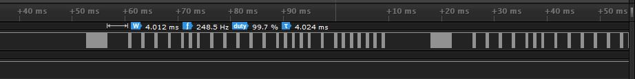
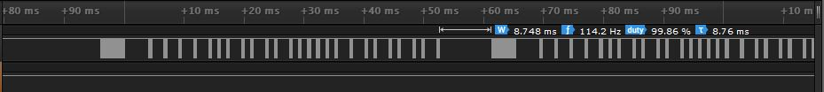
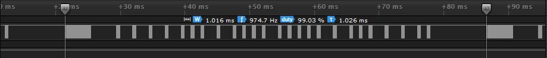
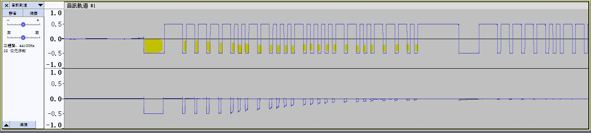

# see mute_wave.txt  

RCA protocol ?  

https://www.sbprojects.net/knowledge/ir/rca.php  

12bit protocol  

4bit address + 8bit command, completment 4bit  8bit  
```
1111 | 0011 0001 | 0000 | 1100 1110 | 0  
F    | 3    1    | 0    | C    E    | 00  
```
0xF310CE00  


carrier frequency 38KHZ  
start, 4ms brust, 4ms silent  
logic 1, 0.5ms brust, 2ms silent  
logic 0, 0.5ms brust, 1ms silent  
24bit  
stop, 0.5ms brust, 8.75ms silent  
frame lenght 65.2ms  

mute  
  
  
power_on  
  
  
button1    
  
 
  
  

bit seq  
```
1111 0011 0001 0000 1100 1110 0  
F    3    1    0    C    E    00  
```
0xF310CE00  

RAW LSB first  
```
1100 1111 0000 1000 0111 0011 0  
C    F    0    8    7    3    00  
```
xCF 0x08 0x73 0x00  
RAW 0x007308CF  

