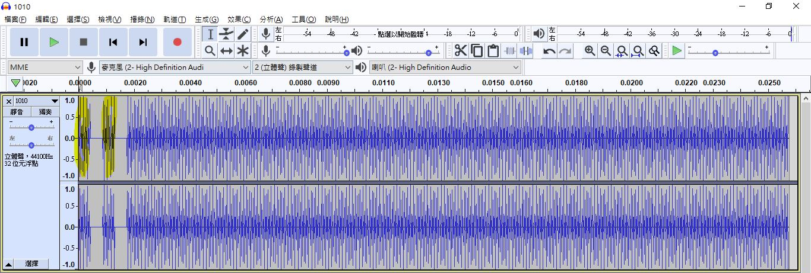
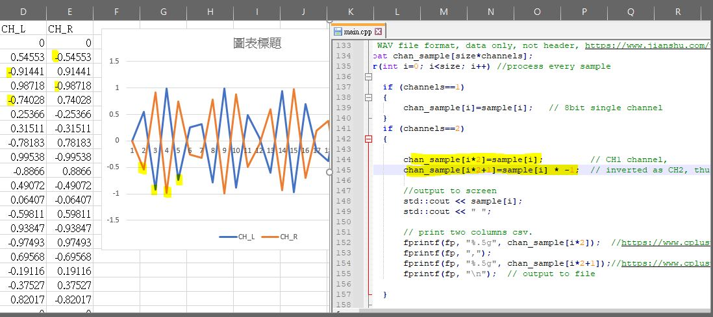
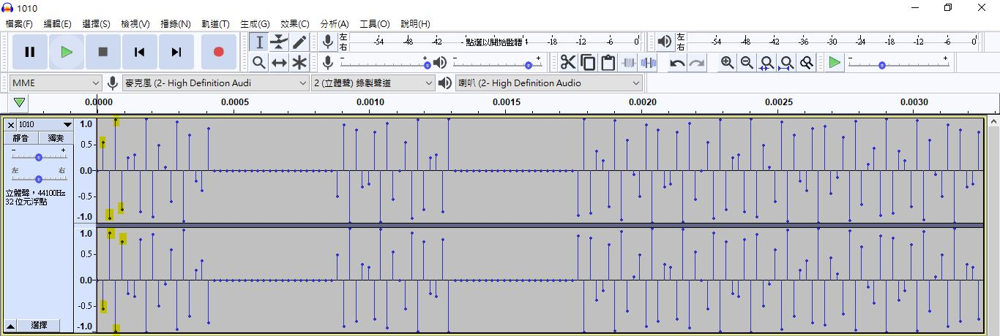
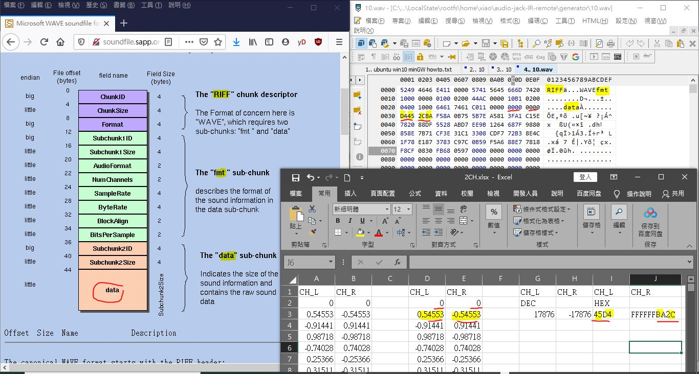
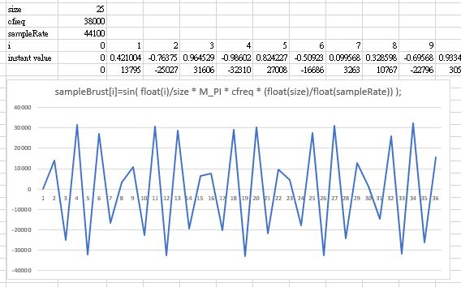
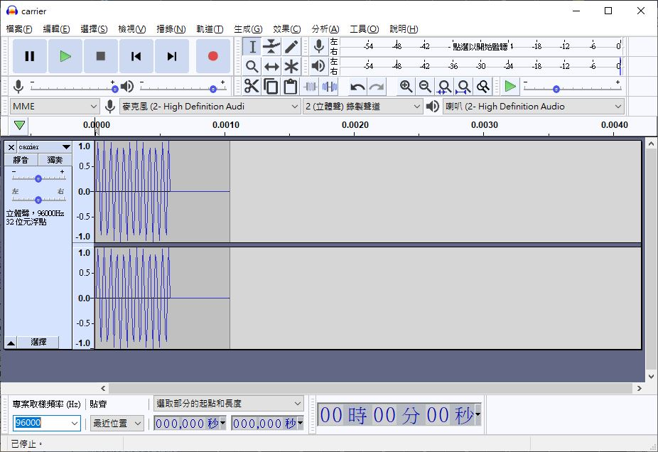
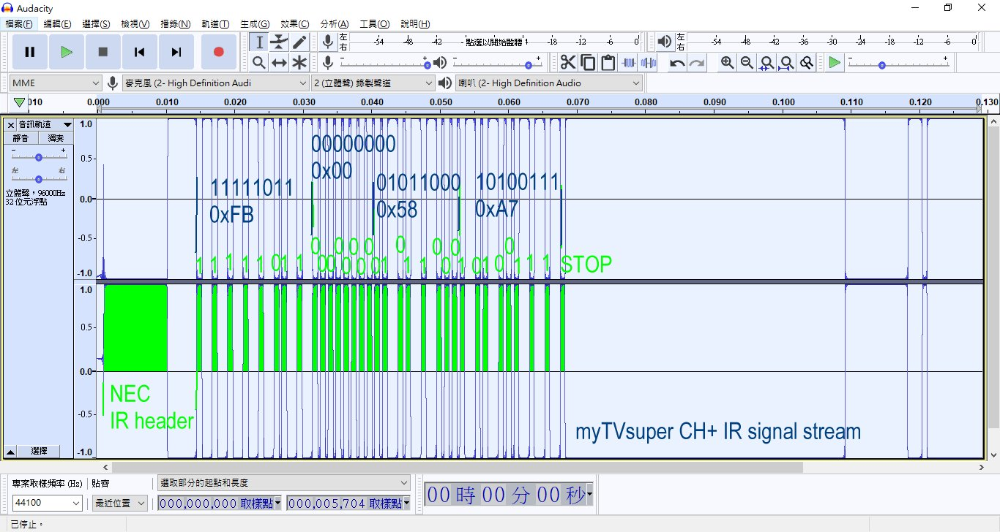
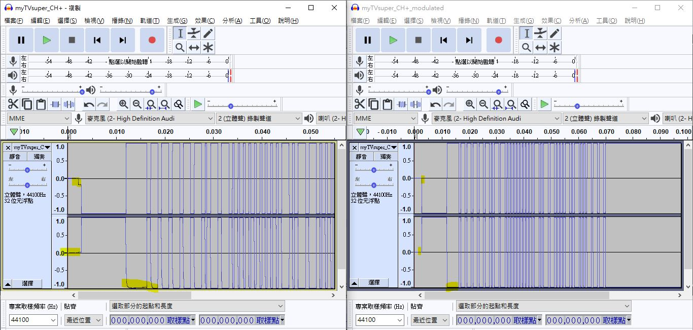
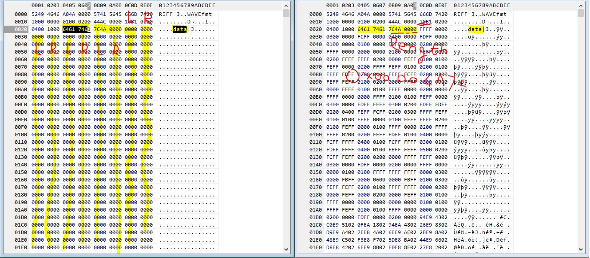
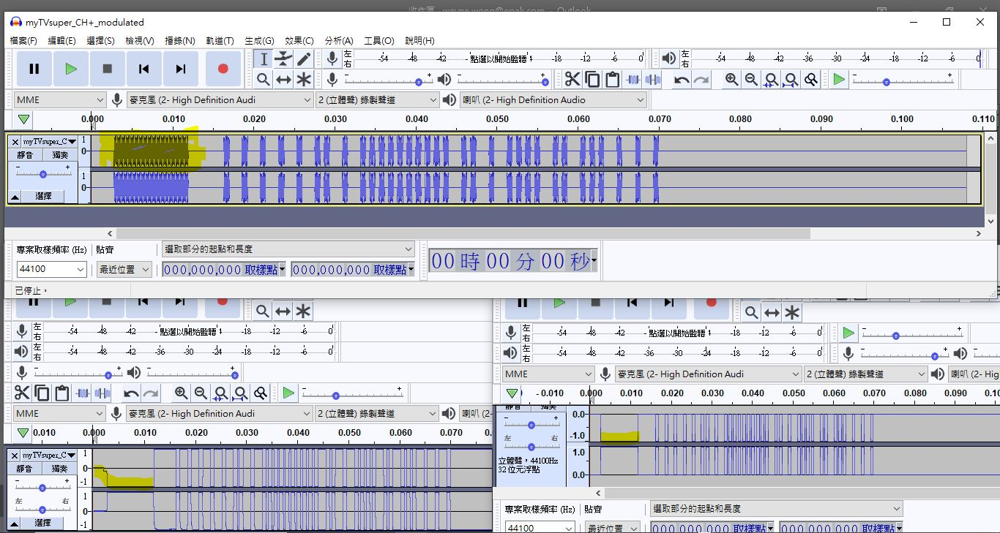

# this genertor app is simple tool to build WAVE file upon user input.  
for example, user input bit stream 10, actual IR drive single will be flikcing/off  
the simplicty of IR remote control would be with this basis  
flikcing = IR LED rapidly on and off with certain frequency  
off = IR LED completely off, no emission IR light  
time/duration in between flikcing/off, and more bit stream will form proper control signal.  

  


### learning material  
Phone jack output, how to get VPinverted phase and the VPP will be 2x

P to max. 
L-GND, R-GND = 1x VPP  
L-R = 2 x VPP, no uses GND

```
//the original code, two channels have same magnitude and phase
            chan_sample[i*2]=sample[i];			// CH1 channel,	
            chan_sample[i*2+1]=sample[i]  	// CH2, thus phone jack output, L- R same phase, refer to GND, 


//change code design, double magnitude
            chan_sample[i*2]=sample[i];			// CH1 channel,	
            chan_sample[i*2+1]=sample[i] * -1; 	// inverted as CH2, thus phone jack output, L-R will get the greatest voltage, no GND used for IR
			
```

### generated wav and intermedeate files for learning  
this is output and plot, it can be seen with 2CH.csv, seeing inverted phase and the VPP will be 2x  
  

this is output wave, uses Audicity to load the 1010.wav, see the same,  
phone jack output will boost to double and drive IR LED  
  

electrical connection like this,  
  


### any better design of generator ?
look at the wave file structure and compare with this tool and generated 1010.wav, it comply with WAVE file format and structure. It is possilbe to have more elegant soltuino to produce IR signal stream with T (flicking, wav date <>0 ) and off (0). T is a unit of IR brust signal, easy.


neglect the first two parts of WAVE HEADER (RIFF & fmt), it is being fixed almost, there is pure data signal data stream, for example,
```
data lenght, 4bytes (this is why WAV no more than 4G size)  
1st sample, 4 bytes ( ch0 16 bit signed & ch1 16 bit singed)  
2nd sample, 4 bytes  
3rd sample, 4 bytes  
...  
and so on  
```

there is a more easy than dumping array to file stream and no need use of "sndfile" libray, unless the design is gong to alter sampling rate on the fly.  

NEC or any other IR procotol, T is defiend a one unit of IR brust (time for IR signal), and also off time.  
For NEC procotol, T = 9/16 mS, considering sampling frequency 44.1KHz, and total samples would be,  
T x 44.1 = 24.8 samples = 25  
and 38KHZ IR signal / 2 = 19KHZ, would be modulated to be with 25 sampling points. both cycles used to drive one IR LED, resultant would be seeing IR signal in 38KHZ flicking  


### manual calcuation for the sampling and to visual the waveform  
sampling frequency is 44100HZ  
IR signal carrier frequency is 38000HZ (NEC protocol)  
here is excel file, [44100modulated38000.xlsx](44100modulated38000.xlsx)  



visual those reconstructed waveform, pretty much the same. sine function & instantaneous value is the sampling point, peak-peak is -1 & 1, floating point value, scaled to 16 bit signed integer would be -32768 to 32767 or in HEX (0x8000 to 0x7FFF). that is all. how many sample used for IR brust that was only how long the IR signal last for, or simplily T, the unit time of IR protocol used, for example NEC is 9/16 = 525us or 0.0000525 sec, RC6 is 1/36KHz * 16 = 444us, and so. This T is valid for IR signaling, and it is also for NO IR signaling. let us say Ton = Toff, when Ton, IR signaling and in contrast, Toff has no IR signal, intentionly putting Ton & Toff together to form a long enough sequency, it would be match to produce something useful, or saying named IR protocol and could be decoded to do something for IR control.

this is basis and concept to bypass library of sndfile (sndfile is library used for produce WAV file), therefore we should be able to write the own WAV generator but no more relying on any library for the specific purpose.  
here is example to build the software with predefiend WAVE file header, quit easy,  

```
/*
	predefined wave file header, 16 bit, 2ch, 44100 sampling rate
	xiaolaba, 2018
*/

// ref: https://gist.github.com/Jon-Schneider/8b7c53d27a7a13346a643dac9c19d34f

// WAV header spec information:
//https://web.archive.org/web/20140327141505/https://ccrma.stanford.edu/courses/422/projects/WaveFormat/
//http://www.topherlee.com/software/pcm-tut-wavformat.html

#define bytes_per_sample 2
#define bits_per_sample 8 * bytes_per_sample


//typedef struct wav_header {
struct wav_header {


    // RIFF Header
    char	riff_header[4] = {'R', 'I', 'F', 'F'};	// Contains "RIFF", uses single quote, exclude \0
    int		wav_size; 					// 32 bit, Size of the wav portion of the file, which follows the first 8 bytes. File size - 8
	char 	wave_header[4] = {'W', 'A', 'V', 'E'}; 	// Contains "WAVE"
    
    // Format Header
    char 	fmt_header[4] = {'f', 'm', 't', ' '}; 	// Contains "fmt " (includes trailing space)
    int 	fmt_chunk_size = 16; 		// 32 bit image = 10000000;  Should be 16 for PCM
    short 	audio_format = 1; 			// 16 bit, image = 0100; Should be 1 for PCM. 3 for IEEE Float
    short 	num_channels = 2;			// 16 bit, image = 0200
//    int 	sample_rate = 44100;		// 32bit, 0x0000ac44, image = 44ac0000
    int 	sample_rate = 96000;		// 32bit

    int 	byte_rate = sample_rate * num_channels * bytes_per_sample; 
										// 32 bit, 176400 = 0x00 02 b1 10 image = 10 1b 02 00, 
										// Number of bytes per second. sample_rate * num_channels * Bytes Per Sample

    short 	sample_alignment = num_channels * bytes_per_sample ;
										// 16 bit, image = 04 00
										// num_channels * Bytes Per Sample

    short 	bit_depth = bits_per_sample;
										// 16 bit, image = 10 00; 
										//Number of bits per sample
    
    // Data
    char 	data_header[4] = {'d', 'a', 't', 'a'};	// Contains "data"
    int 	data_bytes; 				// Number of bytes in data. Number of samples * num_channels * sample byte size
    // uint8_t 	bytes[]; 				// Remainder of wave file is bytes
	
};
// };wav_header;
```


the output of sythzised waveform of 38KHZ signal. it can be loaded by Audicity correctly, and tweaking sampling rate to 96000 was also capable at any time.  
the wav file generated in this way, [carrier.wav](carrier.wav)  
and visual like this,  



### basic knowledge and the modulation to existing wav file
look at the wave form of IR signal stream, +0.5 and -0.5 is very clear to see how to identify IR brust and IR off, and it would be trivial to direct modulate this wave file and ensure sound card output the carrier frequency when IR signal within green period, read the CH2 value and see whether less than -0.5, if it does, mapping the carrier frequency table and replace the CH2 value, easy..hurm  
the wave file of this experiment, [myTVsuper_CH+.wav](myTVsuper_CH+.wav)  
the image of waveform and decoded bit stream, and full table of remote control code [here](https://github.com/xiaolaba/IR-remote-control-code/tree/master/OTT/myTV_Super)   


### Normalised wave file, channel data, L/R only have 3 values either +max, 0 or -max (32767,0,-32768, or in in hex 0x7FFF, 0x0000, 0x8000)  
this waveform view, filtered but no modualtion yet. 


this is binary file & view  


### The formula of mapping Carrier frequency to wav with certain sampling frequency (i.e. 44.1KHz)  
this is simple formula used, the Vi (instantaneous value for the wav file and L-R instantence). here is why and how to derives this from the basic. The original author was given following,  
```
	//sampleBrust[i]=sin( float(i)/size * M_PI * cfreq * (float(size)/float(sampleRate)) );
```
but why was that? and whether too much for us ? let's draw the own conclusion and to see a more simplified form, which is given no more than the original formula but less computational steps or complexity, but anyway, still not yet to a why. looking back to [manual-calcuation-for-the-sampling-and-to-visual-the-waveform, it was the why](https://github.com/xiaolaba/IR-remote-control-code/blob/master/audio-jack-IR-remote/generator/README.md#manual-calcuation-for-the-sampling-and-to-visual-the-waveform)
```
	sampleBrust[i]=sin( i * M_PI * rectified_frquency / sampleRate ); // M_PI, it is PI() of C++
```
the software design and hardware matched together, the sketch and notes following will tells everything behind the scene to formula derived & used, the solution is answer why 19KHZ sine wave would be programmable and playable with the PC sound card & phone jack output. Upon a pair of back-to-back IR diodes for IR signaling stream, there will be 19KHz x 2 = 38KHz IR beam & brusting.  

### Final words  
knowledge of wav file / 38KHz IR signal generator / IR remote control protocol, all those are ready. It is time and trivial task for producing arbitrary wav file for any IR signal stream easy. Recap the IR singaling for remote control, nothing more than those sequencies of on / off.
these are files of wav, from original to filtered and the final one with 19KHz carrier frequency modulated.
[myTVsuper_CH+.wav](myTVsuper_CH+.wav)  
[myTVsuper_CH+_filtered.wav](myTVsuper_CH+_filtered.wav)  
[myTVsuper_CH+_modulated.wav, play this file with IR diode connected to phone jack, try the remote function](myTVsuper_CH+_modulated.wav)  
visual the tramsformation,
  
