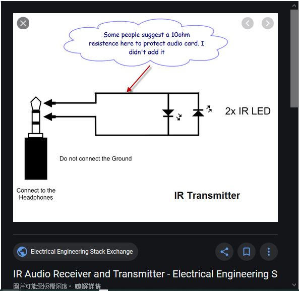

# this genertor app is simple tool to build WAVE file upon user input.  
for example, user input bit stream 10, actual IR drive single will be flikcing/off  
the simplicty of IR remote control would be with this basis  
flikcing = IR LED rapidly on and off with certain frequency  
off = IR LED completely off, no emission IR light  
time/duration in between flikcing/off, and more bit stream will form proper control signal.  

  


### learning material  
Phone jack output, how to get VPinverted phase and the VPP will be 2x

P to max. 
L-GND, R-GND = 1x VPP  
L-R = 2 x VPP, no uses GND

```
//the original code, two channels have same magnitude and phase
            chan_sample[i*2]=sample[i];			// CH1 channel,	
            chan_sample[i*2+1]=sample[i]  	// CH2, thus phone jack output, L- R same phase, refer to GND, 


//change code design, double magnitude
            chan_sample[i*2]=sample[i];			// CH1 channel,	
            chan_sample[i*2+1]=sample[i] * -1; 	// inverted as CH2, thus phone jack output, L-R will get the greatest voltage, no GND used for IR
			
```

### generated wav and intermedeate files for learning  
this is output and plot, it can be seen with 2CH.csv, seeing inverted phase and the VPP will be 2x  
  

this is output wave, uses Audicity to load the 1010.wav, see the same,  
phone jack output will boost to double and drive IR LED  
  

electrical connection like this,  
  


### any better design of generator ?
look at the wave file structure and compare with this tool and generated 1010.wav, it comply with WAVE file format and structure. It is possilbe to have more elegant soltuino to produce IR signal stream with T (flicking, wav date <>0 ) and off (0). T is a unit of IR brust signal, easy.


neglect the first two parts of WAVE HEADER (RIFF & fmt), it is being fixed almost, there is pure data signal data stream, for example,
```
data lenght, 4bytes (this is why WAV no more than 4G size)  
1st sample, 4 bytes ( ch0 16 bit signed & ch1 16 bit singed)  
2nd sample, 4 bytes  
3rd sample, 4 bytes  
...  
and so on  
```

there is a more easy than dumping array to file stream and no need use of "sndfile" libray, unless the design is gong to alter sampling rate on the fly.  

NEC or any other IR procotol, T is defiend a one unit of IR brust (time for IR signal), and also off time.  
For NEC procotol, T = 9/16 mS, considering sampling frequency 44.1KHz, and total samples would be,  
T x 44.1 = 24.8 samples = 25  
and 38KHZ IR signal / 2 = 19KHZ, would be modulated to be with 25 sampling points. both cycles used to drive one IR LED, resultant would be seeing IR signal in 38KHZ flicking  


