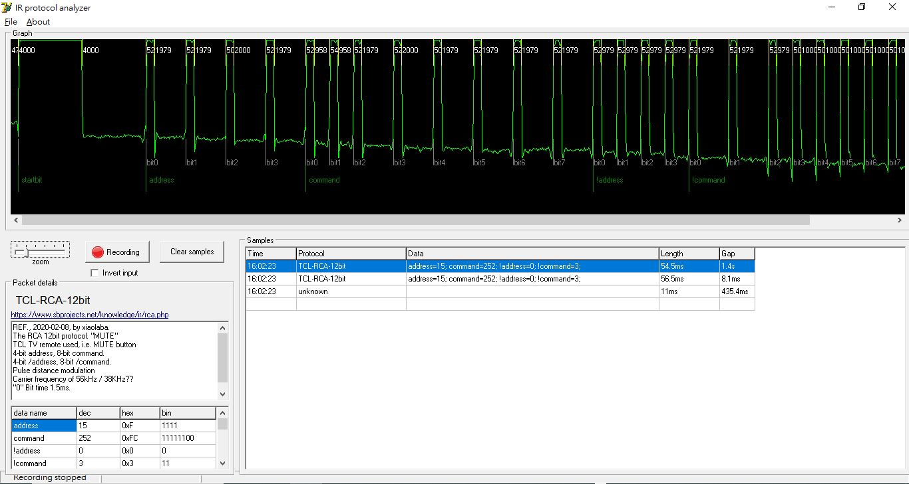

REF:  
https://www.ostan.cz/IR_protocol_analyzer/  
https://www.sbprojects.net/knowledge/ir/rca.php  

### executable
[IR_protocol_analyzer_v1.1](IR_protocol_analyzer_v1.1)  
included the protocol.xml patched.  

### original author's source code
[source_code](source_code/)  

  

no fork, a sole copy and add new protocol following,
[IR_protocol_analyzer_v1.1/TCL_MUTE_sample/protocols.xml](IR_protocol_analyzer_v1.1/TCL_MUTE_sample/protocols.xml)  
```
 <protocol name="TCL-RCA-12bit">
<description url="https://www.sbprojects.net/knowledge/ir/rca.php">
REF., 2020-02-08, by xiaolaba.
The RCA 12bit protocol.
TCL TV remote used, i.e. MUTE button
4-bit address, 8-bit command.
4-bit /address, 8-bit /command.
Pulse distance modulation
Carrier frequency of 56kHz / 38KHz??
"0" Bit time 1.5ms.
"1" Bit time 2.5ms.
</description>
   
    <bitset>
      <bit value="1"> #500 _2000 </bit>
      <bit value="0"> #500 _1000 </bit>
    </bitset>
            
    <packet>
      <delimiter name="startbit">#4000 _4000</delimiter>
      <data name="address" length="4" bitorder="LSB" />
      <data name="command" length="8" bitorder="LSB" />
	  <data name="!address" length="4" bitorder="LSB" />
      <data name="!command" length="8" bitorder="LSB" />
      <delimiter name="stopbit">#500 _5000</delimiter>
    </packet>
  
</protocol>

```

